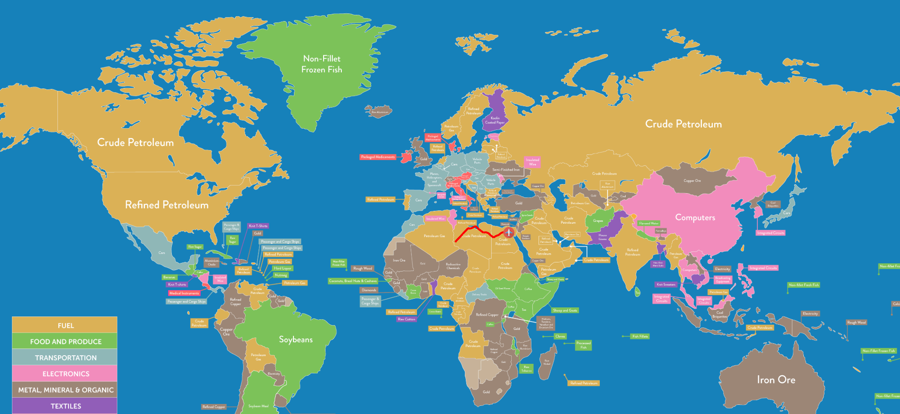

# F.G-Web

 C# ASP .NET MVC server, REST architectural, exhibiting Real-Time route from Flight-Gear. 

 Server-side - flight data stored in DB, entity model created with Code-First, accessed using Entity Framework .

 Client-side - establish connection with server, send ajax requests, answered with data, displays it. 

  
  
  
  
Zoom  |  Full Size
:-------------------------:|:-------------------------:
|

